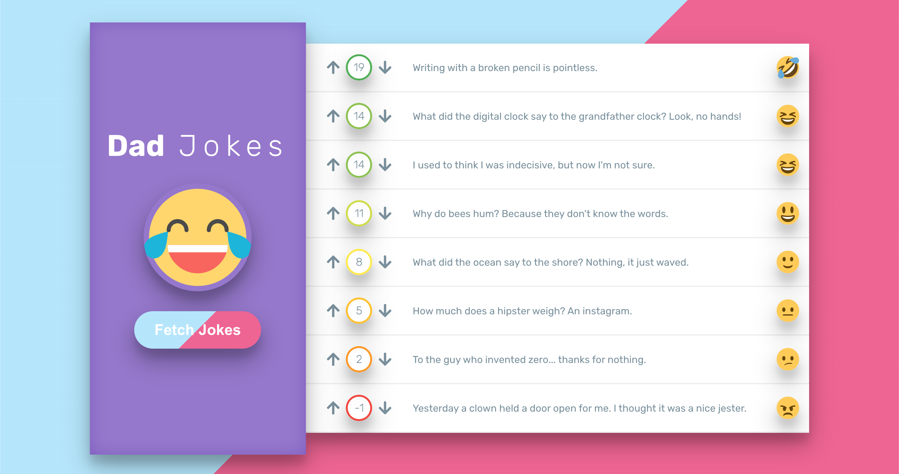

# Dad Jokes App

### Description

This project aims to practice React LifeCycle Methods and use an API. The goal is to Build an app that lets people view and vote on cheesy jokes. To generate jokes, you’ll use the [ICanHazDadJoke API](https://icanhazdadjoke.com/api).

The different tasks to complete are:

- fetch 10 jokes on page load

- list the jokes along with a “vote-up” button, a “vote-down” button and the score for each joke

- add a vote feature that also updates the score

- display a loading spinner or message while jokes are being loaded and hide it once loading is over

- prevent duplicate jokes

- display the jokes sorted by score and update this as the scores change

- store the list of jokes with votes in local storage

- add CSS styling for the joke app including FontAwesome thumbs-up/down images for the voting buttons and an icon for the loading spinner

The app displays an interface that looks like this:

### Technologies

*Languages:* Javascript, HTML, CSS

*Libraries:* React, Axios

### Key features

* Display the jokes

* Fetch jokes from the API

* Display joke votes

* Upvote/downvote a joke

### Poject status

The project is ongoing.

### Credits & Sources

* Another small project from [The Modern React Bootcamp](https://www.udemy.com/course/modern-react-bootcamp)
